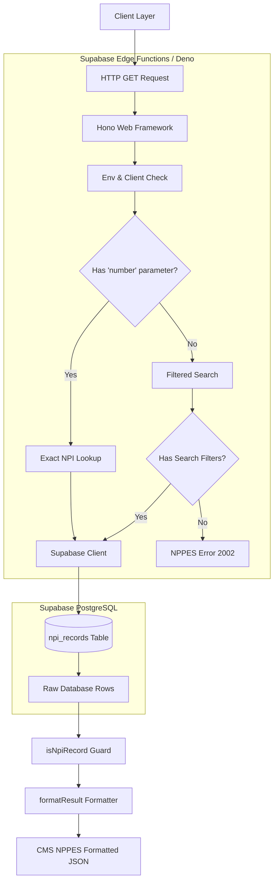

# Architecture Guide

This document outlines the architectural design, component stack, and execution flows for **fakeNPI**.

---

## 🏛️ System Overview

**fakeNPI** provides a self-hosted replica of the Centers for Medicare & Medicaid Services (CMS) NPPES NPI Registry API. The architecture decouples data ingestion from querying by leveraging Supabase's managed PostgreSQL database for storage and Supabase Edge Functions for stateless API execution.



---

## 🛠️ Tech Stack & Dependencies

| Component | Technology | Purpose |
| :--- | :--- | :--- |
| **Runtime Environment** | [Deno](https://deno.com/) via Supabase Edge | Serverless TypeScript execution with minimal startup latency. |
| **Web Framework** | [Hono v4](https://hono.dev/) (`jsr:@hono/hono@^4.13.1`) | Lightweight, high-performance web routing framework. |
| **Database Client** | Supabase JS SDK (`jsr:@supabase/supabase-js@^2`) | Parameterized PostgreSQL queries with row-level security & service role access. |
| **Database** | PostgreSQL (Supabase managed) | Persistent storage for NPI dataset (`npi_records` table). |
| **API Specification** | OpenAPI 3.1.0 (`openapi.yaml`) | Machine-readable API specification describing request/response schemas. |

---

## 🔄 Execution & Data Flow

### 1. Request Routing
Supabase Edge Functions receive the **full invocation path** — e.g., `/functions/v1/nppes-search/api/?...` — not a path relative to the function root. To prevent Hono from failing to match any route, the app is instantiated with an explicit `basePath`:

```ts
const app = new Hono({ basePath: "/functions/v1/nppes-search" });
```

This strips the `/functions/v1/nppes-search` prefix before route matching, so the following routes resolve correctly:
- **`GET /api/`**: Primary search and lookup endpoint.
- **`GET /api`**: Redirects (301) to `/api/` to preserve CMS endpoint convention.
- **`GET /`**: Healthcheck endpoint returning `{ "status": "ok", "version": "1.0.0" }`.

### 2. Query Branching Model
The function processes requests through two mutually exclusive branches:

1. **Exact Lookup Branch (`q.number` present)**
   - Triggered when the `number` parameter (10-digit NPI) is supplied.
   - Bypasses filter criteria and performs an exact lookup on the `npi` column (`limit(1)`).

2. **Filtered Search Branch (`q.number` absent)**
   - Evaluates filter presence (`enumeration_type`, `organization_name`, `city`, `state`, `taxonomy_description`).
   - If no filter parameters are supplied, returns a HTTP 400 error matching CMS code `2002`.
   - Constructs a parameterized query against `npi_records` with pagination range `[skip, skip + limit - 1]`.

### 3. Data Transformation (`formatResult`)
Database rows are stored in a flattened schema (`npi_records`). The `formatResult()` function transforms flat SQL rows into hierarchical CMS NPPES JSON shapes:

- **Entity Discrimination**: Automatically categorizes providers into `NPI-1` (Individual) or `NPI-2` (Organization) based on `isorganization` flags or `enumerationtype`.
- **Basic Metadata**: Maps first name, last name, organization name, authorized official details, status, and last updated timestamps.
- **Addresses Array**: Generates standardized `LOCATION` and `MAILING` address objects.
- **Taxonomies Array**: Constructs taxonomy classification blocks containing code, description, state, license number, and primary classification flags.

---

## 🛡️ Security & Authentication

- **Public Access**: API endpoints are served with `--no-verify-jwt` to allow public client queries, mirroring the public CMS NPI registry.
- **Database Access**: Edge functions connect using `SERVICE_ROLE_KEY` to bypass default Row Level Security (RLS) policies for high-speed read operations.
- **Environment Variables**:
  - `SUPABASE_URL`: Automatically injected by the Supabase Edge runtime.
  - `SERVICE_ROLE_KEY`: Configured via Supabase secrets dashboard.

---

## 📈 Performance & Scalability

- **Module-Level Client Reuse**: The Supabase client is initialized once per Deno worker isolate (`const supabase = createClient(...)`), eliminating connection setup overhead on subsequent requests.
- **Pagination Guards**: Requests are clamped between `1` and `200` results per query (`limit`), preventing unbounded memory consumption.
